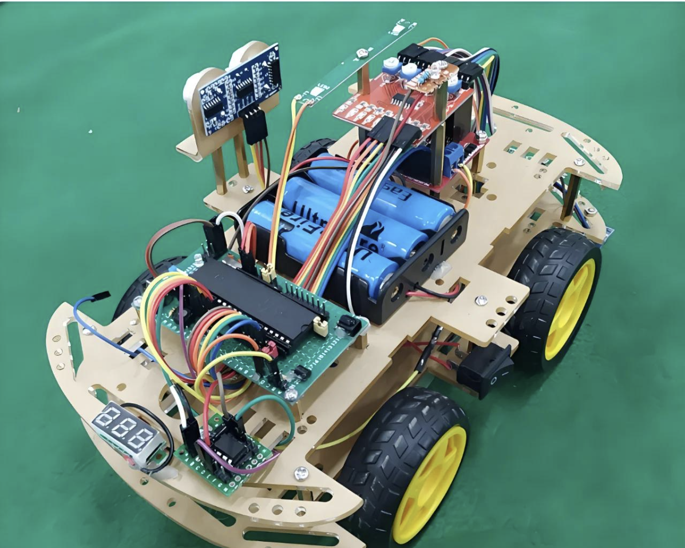
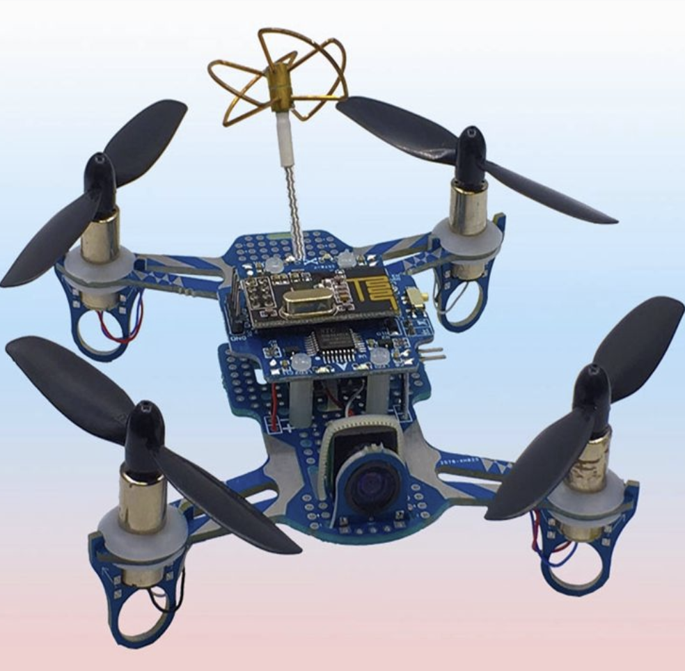
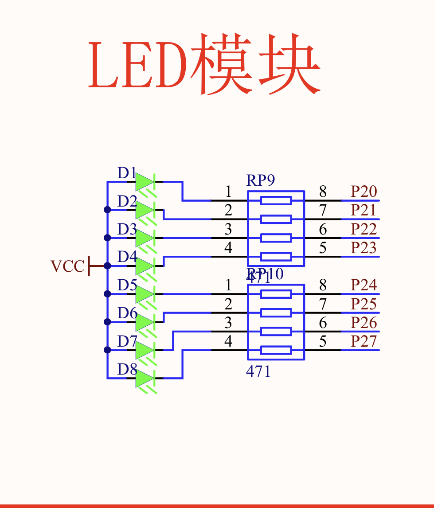

# <!--fit-->零基础入门51单片机（Demo）
 

## 目录
- 基础核心概念
- 会看原理图

---
## 基础核心概念（一）
**什么是单片机：** 单片机（英文常叫 MCU，Microcontroller Unit，微控制器）可以理解为一台“集成在一块芯片上的微型计算机”。
**为什么要研究单片机：** 我们在生活里面，假如想要实现一个简单的红绿灯的开关，那么我们就需要一个计算机来控制红绿灯，但我们有没必要把一个真的像电脑那样的计算机拿出来，因为我们需要实现的功能并不是特别复杂，因此单片机就出现了。单片机的特点就是：**体积小、成本低、功耗低、专一性强** 
总之，单片机主要用于控制和嵌入式系统。

---
### 常见的应用场景
| 红绿灯 | 智能小车 | 无人机 |
| :---: | :---: | :---: |
|  |  |  |

---
## 基础核心概念（二）
**RAM（内存）：** 存变量、数组、临时计算结果。程序运行时频繁读写，但断电就丢。
RAM 像你的办公桌。你干活的时候，把正在用的文件、草稿、计算器都摊在桌上。桌子越大，你能同时处理的东西越多。但下班一关灯、一断电，桌子就被清空了，东西全没了。
**ROM/Flash（只读存储器）：** 存程序代码、固定参数、常量。单片机一上电，就从这里取指令执行。
它是提前写好、存起来的，断电也不会丢。你平时主要是“读”它，照着做。老式 ROM 不能随便改；现在单片机里常用的 Flash 也常被归到 ROM 这一类，可以擦写，但主要是存程序，不是拿来当临时草稿纸。
总之，各位需要知道，上面讲述的这两类都是用来存储东西的

---
## 基础核心概念（三）
**编译：** 把我们的C语言转换为单片机能够读懂的hex文件

**烧录：** 把hex文件给导入单片机的ROM里面，让单片机执行

---

## 会看原理图（以LED模块为例）

P20,P21这表示的是导线的一段，在电路图里面，当电路结构很复杂的时候，我们就会把每一个模块给分出来，同时用字母数字的方法表示不同模块之间导线的相连
VCC就是阳极的意思，D1、D2就是发光二极管
看懂这些原理图，后续在写C语言时，你就会明白为什么要这么写

---
## END